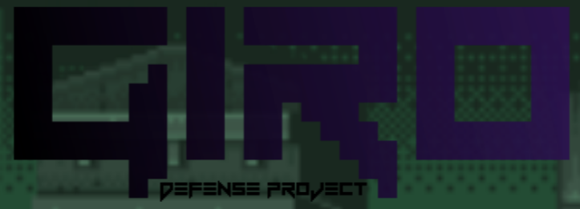

<!-- PROJECT LOGO -->
<br />
<p align="center">
  <a href="https://github.com/Usagib/js-capstone">
    
  </a>

  <h3 align="center">Giro: Phaser 3 developed action platformer</h3>

  <p align="center">
    Shoot and rush your way around the industrial zone!
    <br />
    <a href="https://github.com/Usagib/js-capstone"><strong>Explore the docs »</strong></a>
    <br />
    <br />
    <a href="https://giro-the-game.netlify.app/dist/">View Demo</a>
    ·
    <a href="https://github.com/Usagib/js-capstone/issues">Report Bug</a>
    ·
    <a href="https://github.com/Usagib/js-capstone/issues">Request Feature</a>
  </p>
</p>


<!-- TABLE OF CONTENTS -->
## Table of Contents

- [Table of Contents](#table-of-contents)
- [Play The Game](#play-the-game)
- [About The Project](#about-the-project)
- [Highlights](#highlights)
  - [Controls](#controls)
  - [Objective](#objective)
- [Built With](#built-with)
- [Prerequisites](#prerequisites)
- [Run it Locally](#run-it-locally)
- [Learning Path](#learning-path)
- [Contributing](#contributing)
- [License](#license)
- [Contact](#contact)
- [Acknowledgments](#acknowledgements)

## Play The Game

[Play the first level of Giro now!](https://giro-the-game.netlify.app/dist/)

Watch the gameplay by [Juego sin Manos](https://www.youtube.com/channel/UCAVokpQqehzAPQIHtzQSMJw)

[](http://www.youtube.com/watch?v=6U_y1tkCOow "Giro Gameplay")

<!-- ABOUT THE PROJECT -->
## About The Project

Giro is an independent action platformer developed in Phaser3

## Highlights

* Physics emulated side-scroller videogame
* Dynamic enemy spawn
* API backup leaderboard

### Controls

* Left, Right Keys: Move Giro
* Up Key: Jump
* Spacebar: Fire shoot
* Left click: Select (When Available)

### Objective

* Explore the level to find and complete the boss stage
* Get the highest score by collecting coins, avoiding damage and killing enemies

## Built With

* phaser: 3.23
* webpack : 4.43
* webpack dev server : 3.11


## Prerequisites

* npm
```sh
npm install npm@latest -g
```

### Run it Locally

1. Clone this repo
```sh
git clone https:://github.com/Usagib/js-capstone.git
```
2. run the following command
```sh
npm install
```
1. run the following command
```sh
npm run start
```

## Development Path

* Part I: Researched Phaser 3 game engine
* Part II: Built Phaser 3 docs platformer game
* Part III: Designed and planned Software, Graphics and Assets
* Part IV: Setup enviroment and dependencies
* Part V: Created assets sprite and animations
* Part VI: Created assets animation and tweens
* Part VII: Fixed world tilemap create, sprite animation
* Part VIII: Fixed world tilemap render
* Part IX: Fixed physics behaivour, created map interaction
* Part X: Created dinamyc object creation
* Part XI: Created Parallax movement background
* Part XII: Fixed collision events and hitboxes
* Part XIII: Game physycs fix, Game logic created
* Part XIV: Scene moduling
* Part XV: Code refactoring
* Part XVI: Testing, Style corrections, Deployment

<!-- CONTRIBUTING -->
## Contributing

1. Fork the Project
2. Create your Feature Branch (`git checkout -b feature/AmazingFeature`)
3. Commit your changes (`git commit -m 'Add some AmazingFeature'`)
4. Push to the Branch (`git push origin feature/AmazingFeature`)
5. Open a Pull Request

## License

Distributed under the MIT License.

<!-- CONTACT -->
## Contact

* Eduardo Bonilla Cáceres - eduardobonillac@gmail.com
* [My Portfolio](https://usagib.surge.sh)
* [My Twitter](https://twitter.com/UsagiBonilla)


<!-- ACKNOWLEDGEMENTS -->
## Acknowledgments
* [Microverse](https://www.microverse.org/)
* [Music by Toby Fox](https://twitter.com/tobyfox)
* [Assets by Open Game Art](https://opengameart.org/forums/2d-art)
* [Assets by Crapt Pix](https://craftpix.net/freebies/)
* [Assets by itch.io](https://itch.io/game-assets/free)
